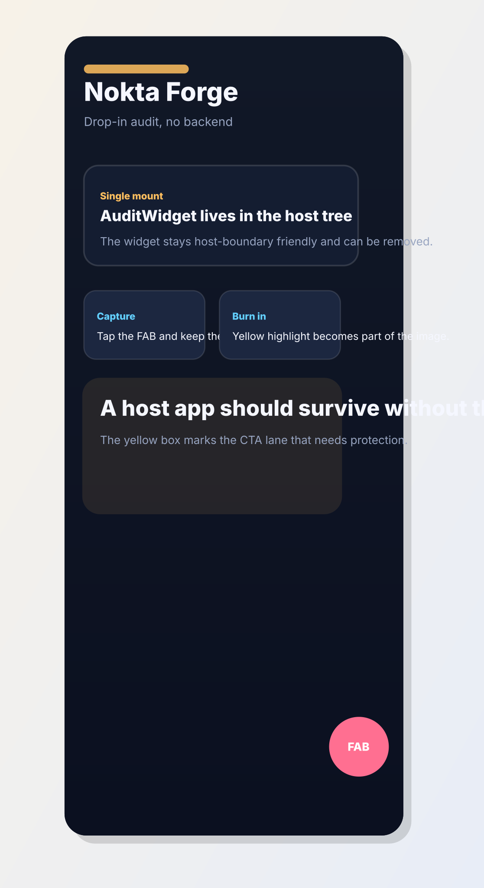

# Home route: CTA collides with the audit lane

- Screen: Home
- Symptom: The primary CTA and the floating audit button compete for the same lower-right safe-area space.
- Note: Reserve a dedicated lane before the widget lands.

## Observation

The page reads well until the FAB appears. The content is fine, but the button stack loses breathing room on narrow widths.

## Hypothesis

The layout is not wrong in isolation. It simply does not account for the host widget boundary.

## Repair

Increase the bottom padding on the hero stack and keep the FAB lane fixed. The widget should remain drop-in friendly even when the route gets denser.

## Burn-in evidence

## Agent input

Use the yellow box as the ground truth. The next change should preserve the CTA while protecting the widget lane.
