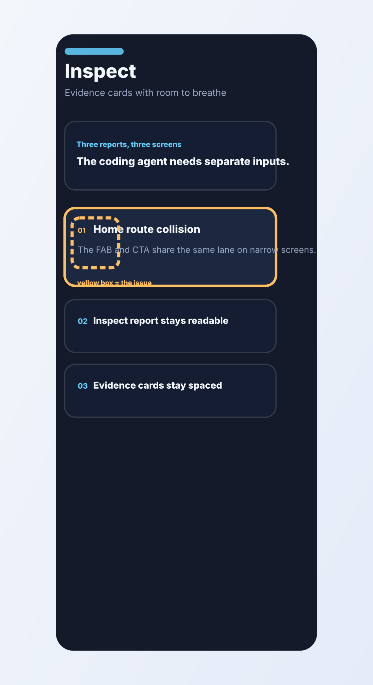

# Inspect route: evidence cards need clearer spacing

- Screen: Inspect
- Symptom: The evidence rail compresses too hard and the route starts to feel noisy.
- Note: Keep one strong card in focus.
- Screenshot asset: assets/inspect-burnin.svg

## Observation

The stack has the right ingredients, but the rhythm between cards is too tight. The main evidence should sit above the fold with more air.

## Hypothesis

The issue is spacing, not content. When everything is visually loud, the agent has no obvious anchor.

## Repair

Add calmer vertical spacing, soften secondary labels, and let the strongest evidence card dominate the frame.

## Burn-in evidence

## Agent input

Treat the burn-in image as the single source of truth. The repair should keep the report readable at a glance.
