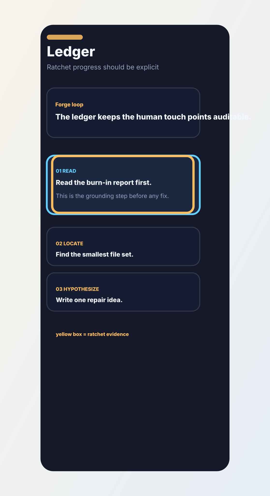

# Ledger route: ratchet progress should be explicit

- Screen: Ledger
- Symptom: The forge story needs a visible ratchet line so rollback does not look like random churn.
- Note: Keep the successful kg values monotonic.

## Observation

The page already shows cycles, but the human reader still needs the learning trail to be obvious.

## Hypothesis

If the ledger names the rollback and keeps the kg values increasing, the cycle story becomes auditable.

## Repair

Add a simple cycle strip, pin the rollback row, and preserve the monotonic weight story across the successful cycles.

## Burn-in evidence

## Agent input

The yellow box should be read as the final warning: do not hide rollback, but do not let it break the ratchet narrative.
