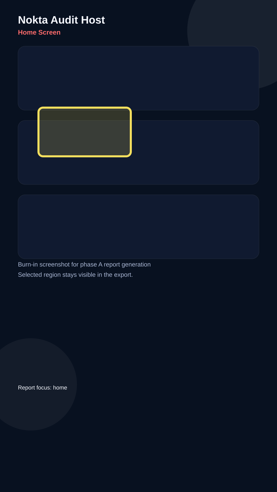

# Audit Report - Home Screen

**Screen:** `Home`
**Reporter:** `local-dev`
**Status:** `open`
**Generated:** `2026-05-19T22:12:00+03:00`

## Observation

The home surface is readable, but the action rail can compete with the hero panel when the screen is dense.

## Note

The highlight box is burned into the screenshot so the coding agent can see exactly which region was under review.

## Next steps

- Keep the floating audit control away from the primary CTA.
- Confirm the export keeps the selected area visible.
- Use the screenshot as the ground truth for the fix loop.
