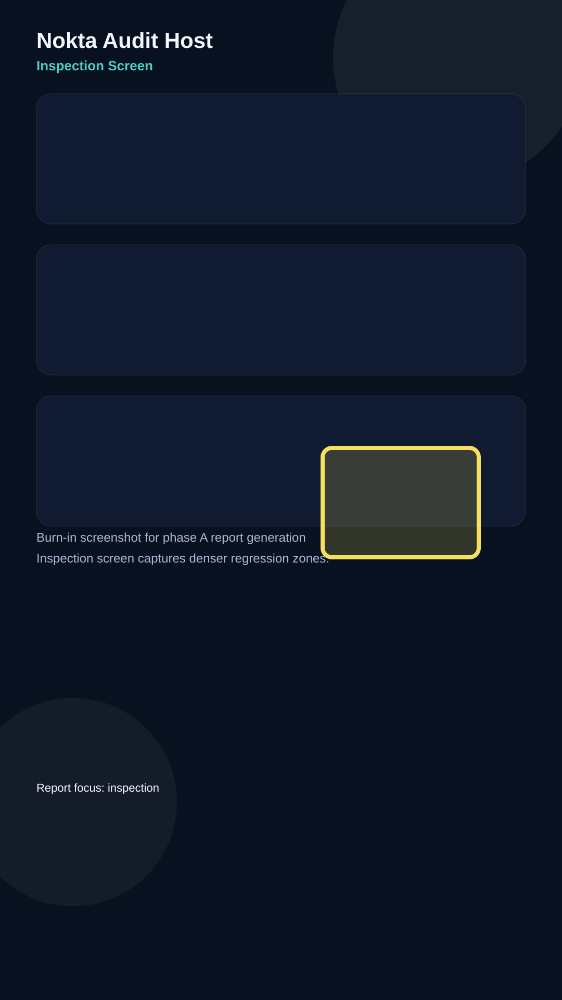

# Audit Report - Inspection Screen

**Screen:** `Inspection`
**Reporter:** `local-dev`
**Status:** `open`
**Generated:** `2026-05-19T22:12:00+03:00`

## Observation

The inspection screen is where layout regressions are easiest to spot, especially around mid-page content blocks.

## Note

Burn-in is visible in the exported image, which makes the affected area unambiguous for the agent.

## Next steps

- Keep the selected box centered in the final artifact.
- Verify the highlight survives Markdown export.
- Compare the export with the live UI before closing the cycle.
