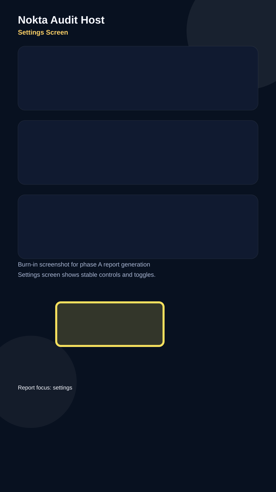

# Audit Report - Settings Screen

**Screen:** `Settings`
**Reporter:** `local-dev`
**Status:** `open`
**Generated:** `2026-05-19T22:12:00+03:00`

## Observation

The settings surface is stable, but it is still worth checking whether small controls stay legible when the audit overlay is present.

## Note

This report keeps the yellow burn-in box in-frame so the audit output is useful even when detached from the app.

## Next steps

- Keep the widget drop-in and non-invasive.
- Confirm the report stays human-readable when pasted into an agent.
- Use this as a clean baseline for the forge loop.
